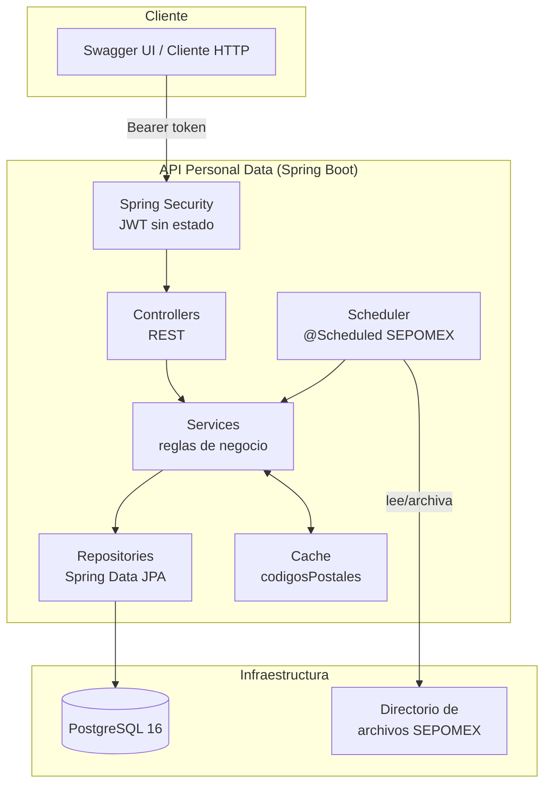
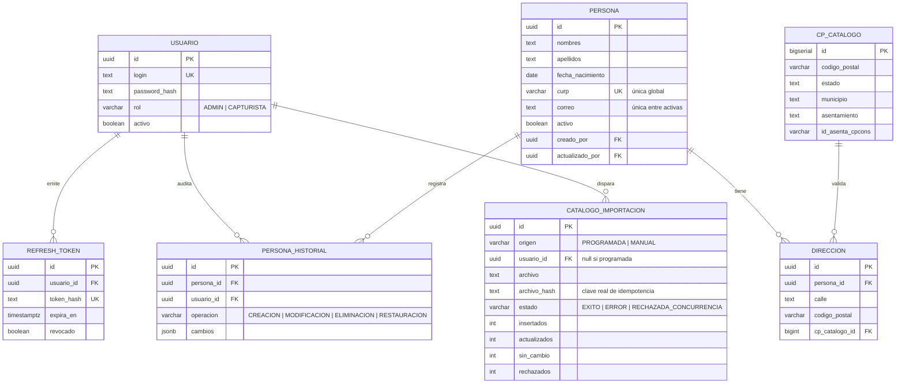
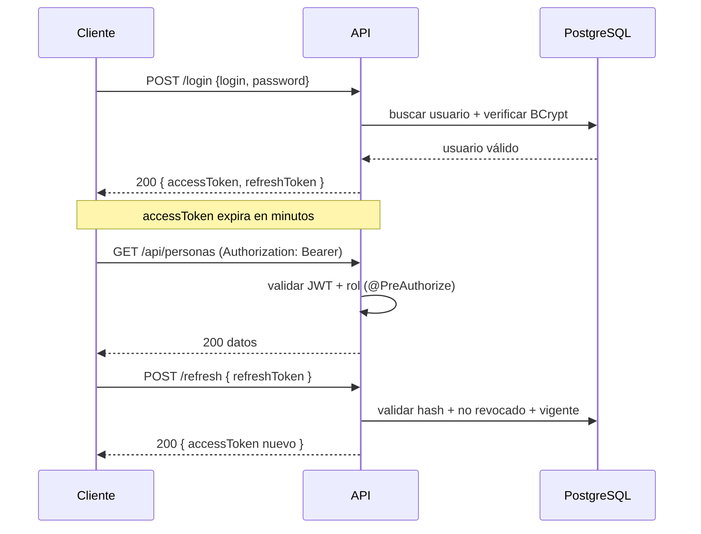
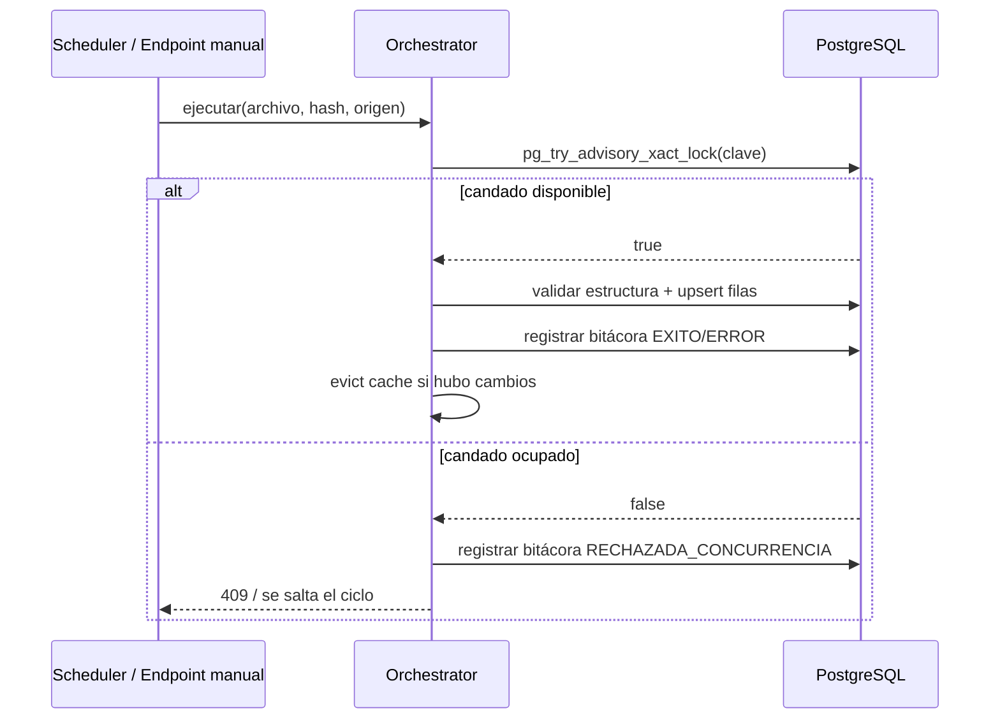
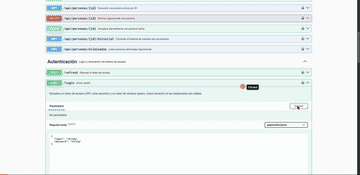

# API Personal Data — Personas & Catálogo SEPOMEX


API REST para la gestión del padrón de personas y el catálogo nacional de códigos
postales de SEPOMEX, con autenticación por roles, auditoría completa de cambios,
búsqueda avanzada y automatización de la actualización del catálogo.

---

## Tabla de contenidos

- [Descripción del proyecto](#descripción-del-proyecto)
- [Funcionalidades](#funcionalidades)
- [Arquitectura](#arquitectura)
- [Modelo de datos](#modelo-de-datos)
- [Flujos clave](#flujos-clave)
- [Stack tecnológico](#stack-tecnológico)
- [Endpoints principales](#endpoints-principales)
- [Instalación y ejecución](#instalación-y-ejecución)
- [Variables de entorno](#variables-de-entorno)
- [Probarlo con Swagger](#probarlo-con-swagger)
- [Testing](#testing)
- [Estructura del proyecto](#estructura-del-proyecto)
- [Principios de diseño](#principios-de-diseño)

---

## Descripción del proyecto

Este proyecto nació como un CRUD de personas con validación contra el catálogo
oficial de códigos postales de México (SEPOMEX), y evolucionó de forma incremental
—feature por feature, cada una documentada bajo `specs/`— hasta cubrir:

1. **Gestión de personas** (alta, consulta, actualización, borrado lógico) con
   validación de dirección contra el catálogo de códigos postales.
2. **Autenticación y autorización** basada en JWT con dos roles (`ADMIN`,
   `CAPTURISTA`).
3. **Auditoría** de quién y cuándo modificó cada registro, con historial inmutable
   de cambios.
4. **Restauración** de personas eliminadas lógicamente, con reglas de unicidad
   global sobre la CURP.
5. **Búsqueda avanzada** de personas (texto insensible a acentos, edad, estado de
   registro) usando Specifications de JPA.
6. **Automatización de la actualización del catálogo SEPOMEX**: job programado,
   disparo manual, bitácora de corridas, y control de concurrencia a nivel de base
   de datos.

Cada feature vive documentada en `specs/00N-nombre-feature/` con su especificación,
plan técnico, decisiones de diseño (`research.md`) y modelo de datos — útil como
referencia de *por qué* se construyó cada cosa de cierta manera.

## Funcionalidades

| # | Feature | Qué resuelve |
|---|---------|--------------|
| 001 | Personas y códigos postales | CRUD de personas + catálogo de CP con importación idempotente |
| 002 | Autenticación y autorización | Login JWT, refresh tokens, roles ADMIN/CAPTURISTA |
| 003 | Auditoría de personas | Quién/cuándo modificó cada registro, historial de cambios |
| 004 | Restaurar persona (CURP) | Restauración de bajas lógicas, CURP única de forma global |
| 005 | Búsqueda avanzada | Filtros combinables: texto sin acentos, edad, estado de registro |
| 006 | Automatización SEPOMEX | Job programado + disparo manual + bitácora + candado de concurrencia |

## Arquitectura



## Modelo de datos



## Flujos clave

### Autenticación



### Importación SEPOMEX (candado de concurrencia)



## Stack tecnológico

| Componente | Tecnología |
|---|---|
| Lenguaje | Java 21 |
| Framework | Spring Boot 3.3.5 (Web, Data JPA, Security, Cache, Validation) |
| Base de datos | PostgreSQL 16 |
| Migraciones | Flyway (aditivas y versionadas) |
| Autenticación | JWT (jjwt) + BCrypt |
| Documentación API | springdoc-openapi (Swagger UI) |
| Mapeo de DTOs | MapStruct |
| Testing | JUnit 5, Mockito, AssertJ, Testcontainers (PostgreSQL real) |
| Contenedores | Docker / Docker Compose |

## Endpoints principales

| Método | Ruta | Rol | Descripción |
|---|---|---|---|
| POST | `/login` | público | Login, devuelve access + refresh token |
| POST | `/refresh` | público | Renueva el access token |
| POST | `/api/personas` | ADMIN, CAPTURISTA | Alta de persona |
| GET | `/api/personas` | ADMIN, CAPTURISTA | Listado paginado con filtros de búsqueda |
| GET | `/api/personas/{id}` | ADMIN, CAPTURISTA | Detalle de una persona |
| PATCH | `/api/personas/{id}` | ADMIN, CAPTURISTA | Actualización parcial |
| DELETE | `/api/personas/{id}` | ADMIN | Baja lógica |
| GET | `/api/personas/{id}/historial` | ADMIN | Historial de cambios |
| POST | `/api/personas/{id}/restaurar` | ADMIN | Restaurar una baja lógica |
| GET | `/api/personas/eliminadas` | ADMIN | Listado de personas eliminadas |
| GET | `/api/codigos-postales/{cp}` | ADMIN, CAPTURISTA | Consulta de un código postal |
| GET | `/api/colonias` | ADMIN, CAPTURISTA | Búsqueda de colonias |
| POST | `/api/codigos-postales/importaciones` | ADMIN | Disparo manual de importación SEPOMEX |
| GET | `/api/codigos-postales/importaciones` | ADMIN | Bitácora de corridas de importación |
| POST | `/api/usuarios` | ADMIN | Alta de usuario operador |
| GET | `/api/usuarios` | ADMIN | Listado de usuarios |
| PATCH | `/api/usuarios/{id}/desactivar` | ADMIN | Desactivar usuario |
| PATCH | `/api/usuarios/{id}/contrasena` | ADMIN | Cambiar contraseña de un usuario |

## Instalación y ejecución

### Requisitos

- Docker y Docker Compose
- (Opcional, solo si no usas Docker) Java 21 + Maven

### Con Docker (recomendado — todo en 2 comandos)

```bash
git clone https://github.com/vladimitrujillo/apiPersonalData.git
cd apiPersonalData
docker compose up -d --build
```

Esto levanta:
- `db`: PostgreSQL 16 en el puerto `5432`
- `app`: la API en el puerto `8080` (construida desde el `Dockerfile` del proyecto)

Al arrancar, la app aplica las migraciones de Flyway automáticamente y siembra un
usuario ADMIN inicial (login `admin`, ver `docker-compose.yml` para la contraseña
de desarrollo — **cámbiala antes de cualquier uso real**).

Verificar que está arriba:
```bash
docker compose ps
docker compose logs -f app
```

Detener todo:
```bash
docker compose down
```

### Sin Docker (Maven local)

```bash
# 1. Levantar solo la base de datos
docker run -d --name personas-db -e POSTGRES_DB=personas -e POSTGRES_USER=app \
  -e POSTGRES_PASSWORD=app -p 5432:5432 postgres:16-alpine

# 2. Compilar
mvn package -DskipTests

# 3. Ejecutar
JWT_SECRET=una-clave-de-al-menos-32-bytes \
ADMIN_BOOTSTRAP_LOGIN=admin \
ADMIN_BOOTSTRAP_PASSWORD=CambiaEstaContrasena123 \
java -jar target/api-personal-data-0.1.0-SNAPSHOT.jar
```

## Variables de entorno

| Variable | Default | Descripción |
|---|---|---|
| `DB_URL` | `jdbc:postgresql://localhost:5432/personas` | URL de conexión a PostgreSQL |
| `DB_USERNAME` / `DB_PASSWORD` | `app` / `app` | Credenciales de la base de datos |
| `JWT_SECRET` | *(requerido)* | Clave para firmar los JWT (mín. 32 bytes) |
| `ACCESS_TOKEN_TTL_MINUTES` | `15` | Vigencia del access token |
| `REFRESH_TOKEN_TTL_DAYS` | `7` | Vigencia del refresh token |
| `SWAGGER_PUBLICO` | `true` | Si Swagger UI es accesible sin autenticación (**poner en `false` en producción**) |
| `ADMIN_BOOTSTRAP_LOGIN` / `ADMIN_BOOTSTRAP_PASSWORD` | *(vacío)* | Credenciales del ADMIN inicial sembrado al arrancar |
| `SEPOMEX_IMPORT_CRON` | `0 0 3 * * MON` | Periodicidad del job de importación (cron) |
| `SEPOMEX_DIRECTORIO_ENTRADA` | `./sepomex-entrada` | Carpeta que el job revisa en busca de archivos nuevos |
| `SEPOMEX_DIRECTORIO_PROCESADOS` | `./sepomex-procesados` | Carpeta donde se archivan los archivos ya importados |
| `SEPOMEX_ARCHIVO_TAMANO_MAXIMO` | `20MB` | Tamaño máximo de archivo aceptado en la subida manual |
| `SERVER_PORT` | `8080` | Puerto HTTP de la API |

## Probarlo con Swagger

Con la app corriendo (Docker o local):

1. Abre **`http://localhost:8080/swagger-ui/index.html`**
2. Obtén un token de acceso:
   ```bash
   curl -s -X POST -H "Content-Type: application/json" \
     -d '{"login":"admin","password":"<tu-password>"}' \
     http://localhost:8080/login
   ```
3. Copia el `accessToken` de la respuesta.
4. En Swagger, haz clic en **Authorize** (arriba a la derecha) y pega el token.
5. Ya puedes probar cualquier endpoint directamente desde el navegador — incluido
   subir un catálogo SEPOMEX en `POST /api/codigos-postales/importaciones`.

**Demo animado** — login, Authorize y una llamada autenticada real contra la API
corriendo en Docker:



## Testing

El proyecto sigue Test-First con suite siempre verde (principio no negociable de
este proyecto — ver `.specify/memory/constitution.md`):

```bash
mvn test           # 143 tests unitarios (rápidos, sin base de datos real)
mvn verify          # + 73 tests de integración (Testcontainers, PostgreSQL real)
```

**216/216 tests pasando** — cobertura incluye desde reglas de negocio unitarias
hasta escenarios de concurrencia real (candado de importación, lectura durante
carga) contra una base de datos PostgreSQL real vía Testcontainers.

## Estructura del proyecto

```text
src/main/java/mx/personas/api/
├── auth/            # Login, refresh tokens, JWT
├── usuario/          # Gestión de usuarios operadores (ADMIN/CAPTURISTA)
├── persona/           # CRUD, historial, restauración, búsqueda avanzada
├── codigopostal/      # Catálogo CP, colonias, importación SEPOMEX
└── common/            # Seguridad, manejo de errores, auditoría, config

src/main/resources/
├── application.yml
└── db/migration/     # V1...V6, aditivas y versionadas (Flyway)

specs/                # Documentación de cada feature (spec, plan, decisiones)
├── 001-personas-codigos-postales/
├── 002-autenticacion-autorizacion/
├── 003-auditoria-personas/
├── 004-restaurar-persona-curp/
├── 005-busqueda-avanzada-personas/
└── 006-sepomex-import-automatico/
```

## Principios de diseño

Este proyecto se rige por una constitución explícita (`.specify/memory/constitution.md`)
con principios no negociables, entre ellos:

- **Test-First con suite siempre verde**: ningún cambio se da por terminado si rompe
  un test existente.
- **Migraciones solo aditivas y versionadas**: nunca se edita una migración ya
  aplicada; los cambios de esquema siempre son hacia adelante.
- **Privacidad por diseño**: los datos personales (padrón) y los datos de identidad
  del operador (`usuario`) están claramente separados.
- **No romper el contrato**: los endpoints existentes no cambian de forma
  incompatible entre features.
